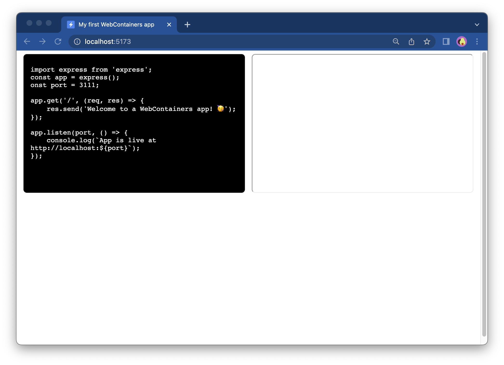

# Setting up WebContainers

Now that the scaffolding for your app is done, you'll make the dev server capable of running WebContainers and then, you'll boot up the WebContainers with your files.

## 1. Set up COOP/COEP headers

As stated in [Quickstart](/guides/quickstart), WebContainers can only run with the following headers set on the document:

```yaml
Cross-Origin-Embedder-Policy: require-corp
Cross-Origin-Opener-Policy: same-origin
```

Let's get these set. Open your `vite.config.js` file (or create it in your app's root directory if it doesn't exist) and add the following code:

::: code-group

```js [vite.config.js]
import { defineConfig } from 'vite';

export default defineConfig({
  server: {
    headers: {
      'Cross-Origin-Embedder-Policy': 'require-corp',
      'Cross-Origin-Opener-Policy': 'same-origin',
    },
  },
});
```

:::

We need to restart the Vite app now. To do so, in your terminal stop the dev server (`ctrl`+`c`). Then, start it again by running `npm run dev`. Next, hard reload the page in the browser (`cmd`+`shift`+`r` on Mac and `ctrl`+`shift`+`r` on Windows and Linux). The headers are now enabled.

## 2. Install WebContainer API package

To add the WebContainer API to your app, install their npm package by running the following code in the terminal (in your app's root directory):

```bash
npm i @webcontainer/api
```

## 3. Boot up a WebContainer instance

Add the following code to the `main.js` file after the first `import` statement:

```js
import { WebContainer } from '@webcontainer/api';

/** @type {import('@webcontainer/api').WebContainer}  */
let webcontainerInstance;

window.addEventListener('load', async () => {
  // Call only once
  webcontainerInstance = await WebContainer.boot();
});
```

Congrats - your first WebContainer app is already running in the background 👏

## 3. Create the files

Let's now add an Express app to the WebContainer. It is going to have two files: `index.js` and `package.json`. The output of this app will be visible in the Preview window on the right.

For your reference, their contents are as follows (no need to copy):

::: code-group

```js [index.js]
import express from 'express';

const app = express();
const port = 3111;

app.get('/', (req, res) => {
  res.send('Welcome to a WebContainers app! 🥳');
});

app.listen(port, () => {
  console.log(`App is live at http://localhost:${port}`);
});
```

:::

And, `package.json`:

::: code-group

```json [package.json]
{
  "name": "example-app",
  "type": "module",
  "dependencies": {
    "express": "latest",
    "nodemon": "latest"
  },
  "scripts": {
    "start": "nodemon --watch './' index.js"
  }
}
```

:::

So, how to get these files *inside* the WebContainer?

First, in your app's root directory create a new file called `files.js` where you will store the object containing these files. Later on, you will then pass this object to a method called `mount`.

While you can keep them in `main.js` we suggest having a separate file in this tutorial for code clarity.

::: code-group

```js [files.js]
/** @satisfies {import('@webcontainer/api').FileSystemTree} */

export const files = {
  'index.js': {
    file: {
      contents: `
import express from 'express';
const app = express();
const port = 3111;

app.get('/', (req, res) => {
  res.send('Welcome to a WebContainers app! 🥳');
});

app.listen(port, () => {
  console.log(\`App is live at http://localhost:\${port}\`);
});`,
    },
  },
  'package.json': {
    file: {
      contents: `
{
  "name": "example-app",
  "type": "module",
  "dependencies": {
    "express": "latest",
    "nodemon": "latest"
  },
  "scripts": {
    "start": "nodemon --watch './' index.js"
  }
}`,
    },
  },
};
```

:::

As you can see, we have a `files` object, which contains the files we want to load into the WebContainer.

::: tip
If you struggle with the structure of this object, please visit [the section on the mental model](/guides/working-with-the-file-system.html#mental-model) of the file system.
:::

Last but not least, add another import statement to `main.js`:

::: code-group

```js [main.js]
import { files } from './files';
```

:::

## 4. Load the files

Now, let's load these files into the WebContainer. Take a look at the highlighted line in the snippet below:

::: code-group

```js {11} [main.js]
import './style.css';
import { WebContainer } from '@webcontainer/api';
import { files } from './files';

/** @type {import('@webcontainer/api').WebContainer}  */
let webcontainerInstance;

window.addEventListener('load', async () => {
  // Call only once
  webcontainerInstance = await WebContainer.boot();
  await webcontainerInstance.mount(files);
});

```

:::

To confirm that it worked, let's read the contents of `package.json` from WebContainer by using the `fs.readFile` method provided by `webcontainerInstance` and log it into the console:

```js {6-7}
window.addEventListener('load', async () => {
  // Call only once
  webcontainerInstance = await WebContainer.boot();
  await webcontainerInstance.mount(files);

  const packageJSON = await webcontainerInstance.fs.readFile('package.json', 'utf-8');
  console.log(packageJSON);
});
```

Now, open the console of your dev tools and see the output:


You can now delete the last two lines.

::: info Learn more: WebContainers behavior

At this point, you may notice that WebContainers send requests to `staticblitz.com`. This is our domain to host/serve our static assets and package manager-related requests. In some cases, you may see a few calls to this domain - for example when you're installing dependencies and don't have a lockfile, which will require a full dependency resolution and multiple calls to the npm registry.

:::

## 5. Set `textarea`'s value

Now that you have a file system, you can print the contents of a file in the `textarea`, for example, the `index.js` file:

```js {2}
window.addEventListener('load', async () => {
  textareaEl.value = files['index.js'].file.contents;
  
  // Call only once
  webcontainerInstance = await WebContainer.boot();
  await webcontainerInstance.mount(files);
});
```

Now you should see the contents of the file rendered in the `textarea` box:



## Next step

Your first WebContainer app is ready and running 🔥 [In the next step](./3-installing-dependencies.md), you'll install the dependencies.
